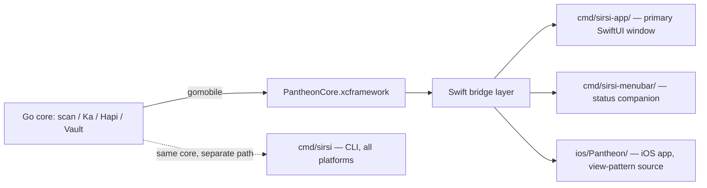

# ADR-018: Native macOS App + CLI as Pantheon's Interactive Surfaces (v0.22 TUI Sunset)

> **Scoping note (added 2026-05-29 per ADR-020):** "TUI Sunset" in this title refers **only to the v0.22 BubbleTea implementation** that was unreleasable and was deleted in v0.23. It does **not** mean Sirsi/Pantheon abandons the TUI surface category. ADR-020 reopened that decision and closed Hybrid C: a new Mole-grade TUI is in design and ships first cross-platform; this ADR's native-Mac direction is deferred (not cancelled) to a later phase. Read this ADR as a historical record of the 2026-05-21 decision; current direction lives in ADR-020.

## Status
**Partially In Force — Amended By [ADR-020](ADR-020-INTERACTIVE-SURFACE-REOPENED.md)** (2026-05-29)
**Originally Accepted** — 2026-05-21
**Deciders:** Cylton Collymore (user authorization), codex-pantheon (review: approve-with-conditions), claude-pantheon (proposal)
**Supersedes:** [ADR-016 (TUI as Primary Interface)](ADR-016-TUI-PRIMARY-INTERFACE.md)
**Amended By:** [ADR-020 (Interactive Surface Reopened)](ADR-020-INTERACTIVE-SURFACE-REOPENED.md) — the v0.22 TUI deletion (this ADR's tactical action) stays in force; the strategic claim that Pantheon abandons the TUI surface category is rescinded. Per Hybrid C closure of ADR-020 (2026-05-29), the Mac native direction this ADR chose is **deferred** to a later phase after a new Mole-grade TUI ships first.
**Related:** [ADR-010 (Menubar Application)](ADR-010-MENUBAR-APPLICATION.md), [ADR-015 (Deity Hierarchy)](ADR-015-DEITY-HIERARCHY.md), [ADR-017 (Ra/Horus CTR Hypervisor)](ADR-017-RA-HORUS-CTR-HYPERVISOR.md), [ADR-020 (Interactive Surface Reopened)](ADR-020-INTERACTIVE-SURFACE-REOPENED.md)

> **Note on numbering:** the proposal referenced "ADR-016-NATIVE-MAC-APP". That slot is already occupied by *ADR-016 (TUI as Primary Interface)*, which this ADR supersedes. The correct next-available number per the ADR-INDEX is **ADR-018**.

## Context

Pantheon shipped v0.21.0 (2026-05-12/13) with the terminal TUI declared "End-to-End Complete." On 2026-05-21, user UAT of `~/.local/bin/sirsi` (v0.22.0-beta, post-refactor `3909532`) reproduced ten concrete failures in the post-scan view (decorative-only tabs, single-action surface, broken checkboxes, wrong color semantics, wrong deity attribution per Rule A25, stale CLI vocabulary, unrenderable header glyph, no key legend, no scroll affordance, no visual hierarchy). User assessment: *"utterly unreleasable… would damage Sirsi's reputation forever."*

User's quality benchmark is **Mole** (`/Applications/Mole.app`, `com.tw93.MoleApp` v1.2.0). Forensic inspection (Rule A19 — read-only) confirmed Mole is a 5 MB native macOS SwiftUI/AppKit/SceneKit binary using Sparkle for updates — not a TUI. A terminal TUI cannot match native-app polish on typography, imagery, animation, or input model. That is a property of the medium, not a bug to fix.

User memory already carried two warnings about this exact failure mode (`feedback_menubar_broken.md`, `feedback_mole_quality.md`). The v0.21.0 "complete" claim was made despite them. This is the second instance of "complete features end-to-end before polishing" being violated.

Codex review (2026-05-21, `.agents/idea-router/reviews/20260521-codex-pantheon-mac-native-cli-pivot-review.md`) approved the pivot with conditions.

## Decision

Pantheon's interactive surface becomes a **native macOS SwiftUI app**. CLI remains the automation backbone on **all** platforms. The terminal TUI is **sunset**.

### Platform matrix

| Platform | Interactive UI | CLI |
|----------|---------------|-----|
| macOS    | **Native SwiftUI app** (`cmd/sirsi-app/`, standalone) + `cmd/sirsi-menubar/` (companion status surface) | `sirsi <verb>` (existing, hardened) |
| Linux    | None — CLI only | `sirsi <verb>` — **partial parity**, audited per Codex condition |
| Windows  | None — CLI only | `sirsi <verb>` — **planned, not parity**, audited per Codex condition |

The TUI in `internal/output/tui*.go` (~4,800 LOC across 20 files) is frozen now and deleted after Mac app v1.0 parity is approved by user UAT.

### Architectural choices (Codex-conditioned)

1. **Native macOS SwiftUI, not Catalyst.** Multiplatform SwiftUI patterns are used where they fit; Catalyst polish ceiling is not accepted as foundation.
2. **Standalone app target + menubar companion.** `cmd/sirsi-app/` is the primary window architecture. `cmd/sirsi-menubar/` remains the status/companion surface. The two share a core/bridge layer. We do **not** extend the menubar binary into a window-bearing app — that path repeats the "small surface grows into product shell" failure of v0.21.0.
3. **Reuse before greenfield.** Phase 1 reuse audit of `cmd/sirsi-menubar/`, `ios/Pantheon/`, and `mobile/*.go` gomobile bindings (PantheonCore.xcframework v0.17.0) precedes any view-level code. iOS views are *adapted*, not blindly forked or Catalyst-wrapped.
4. **First vertical slice = Status.** Smallest bridge risk; reuses `cmd/sirsi-menubar/` stats collection (105 ms cadence).
5. **TUI cadence — IMMEDIATE ELIMINATION (user-escalated 2026-05-21):**
   - **2026-05-21 (this commit):** all 20 TUI files deleted from `internal/output/` (`tui.go`, `dashboard.go`, all `tui_*.go`, all TUI tests, `suggestions.go`, `coverage_boost_test.go`, `output_sprint_test.go`). All 4 `cmd/sirsi/main.go` TUI entry points removed (no-arg `LaunchTUI`, `status --live`, `sirsi pantheon`/`sirsi tui` aliases, the `showGateway` menu's TUI dispatch). Dead `showGateway` function deleted entirely.
   - **Now:** `sirsi` with no args prints help. There is no interactive surface in the terminal. CLI is the only terminal surface.
   - **Until Mac app v1.0 ships:** Mac users also use CLI only (no interactive UI of any kind).
   - **Kept:** `internal/output/terminal.go`, `result.go`, `pid_*.go` — styled non-interactive CLI output used by every verb. The `internal/output/` package is no longer a TUI module.
   - **Note vs Codex condition:** Codex recommended freeze-then-delete-at-v1.0-parity. User overrode to immediate deletion (reputational-risk reasoning: keeping the broken TUI behind any flag preserves the failure surface). ADR-018 reflects the user's stronger position.
6. **Distribution:** Developer ID + notarization + **Sparkle** first. Mac App Store evaluated later only if sandboxing does not break value (e.g., Ka ghost detection across user `~/Library` paths).
7. **No Mole asset reuse.** Mole sets the quality bar; it is not a source of imagery, color tokens, or visual identity. Pantheon uses its own Egyptian gold/lapis tokens (see Rule A10).
8. **Honest CLI compatibility matrix.** Before v0.23 messaging, publish `docs/CLI_COMPATIBILITY.md` listing every `sirsi` verb against macOS / Linux / Windows status (supported / partial / planned). No implied parity for Windows.

## Alternatives Considered

1. **Fix the TUI.** Rejected. The failures user observed are not bugs; they are medium-ceiling issues (input model, typography, imagery). The v0.21.0 attempt already burned a session declaring it complete; another iteration would not change the ceiling.
2. **Mac Catalyst wrap of `ios/Pantheon/`.** Rejected per Codex condition. Catalyst caps polish below Mole's bar and below `cmd/sirsi-menubar/`'s already-native baseline.
3. **Extend `cmd/sirsi-menubar/` into a window-bearing app (single binary).** Rejected. Repeats the failure mode of one binary growing into a product shell. Codex preference: standalone primary + menubar companion with shared core.
4. **Greenfield Swift from zero.** Rejected. Wastes the gomobile bindings, the iOS SwiftUI codebase, and `cmd/sirsi-menubar/`'s native foundation. Path is *connection*, not greenfield.
5. **Electron / Tauri / web-shell.** Rejected. Mole is 5 MB native; Electron starts at 60 MB+ and fails the brand bar before the first frame.
6. **Drop TUI immediately without a Mac replacement.** Considered. Codex condition: freeze now (hide from default), delete only after Mac app parity. Adopted.

## Consequences

### Positive
- Brand surface matches the stated quality benchmark (Mole) on the medium that can actually carry it.
- CLI remains the cross-platform automation contract — no platform left without `sirsi <verb>`.
- iOS / macOS / menubar share one Swift core layer; gomobile bindings amortized across three targets.
- Removes ~4,800 LOC of broken-by-medium TUI code at v1.0.
- Honest labeling per Rule A14 (Statistics Integrity) and Codex condition: Windows is "planned," not "parity."

### Negative
- Mac app development requires Xcode, codesigning identity, notarization pipeline, Sparkle update server. New CI gates.
- Two interactive surfaces to keep aligned (app + menubar companion) — bridge-layer discipline required.
- Linux/Windows users get no interactive UI. Acceptable: the existing TUI did not work for them either (deity attribution + glyph rendering bugs), and Pantheon's value is primarily on macOS workstations where the gomobile/Ka/Spotlight/LaunchServices surface area lives.

### Risk
- Bridge layer between Go core (gomobile) and Swift app could drift; ADR-008 (Shared Filesystem Index) and ADR-009 (Injectable Providers) constrain the contract. Phase 1 audit documents the contract.
- Sparkle requires a hosted appcast.xml — adds operational surface (Rule A11 — scan data privacy: appcast must serve metadata only, never telemetry).
- "Native polish" is judged by user UAT, not CI. UAT gates per surface (Codex condition) prevent the v0.21.0 "complete" anti-pattern from recurring.

## Neith's Architecture Triad (Rule A22) — Phase-0 lightweight version

> Full Triad is delivered in Phase 2 (mockups + per-surface decision points). This Phase-0 version is sufficient for ADR approval; Phase 2 expands it.

### Data Flow (lightweight)

### Implementation Order (lightweight)

| Phase | Output | Gate |
|-------|--------|------|
| 0 | This ADR + Phase-0 sprint plan (`docs/sprints/SPRINT-NATIVE-MAC-APP-PHASE-0.md`) | **User approval of ADR-018** |
| 1 | Reuse audit doc covering `cmd/sirsi-menubar/`, `ios/Pantheon/`, `mobile/*.go`, Mole bundle (read-only) | User approval of audit |
| 2 | SwiftUI mockups + per-surface decision matrix + full Neith Triad in this ADR | User approval of mockups |
| 3 | `cmd/sirsi-app/` scaffold + Status surface vertical slice, codesigned, Sparkle-wired | User UAT of Status |
| 4+ | Per-surface UAT gate: Scan → Clean → Ghosts → Dedupe → Health → Quality → Intel → Settings | User UAT per surface |
| v1.0 | All surfaces UAT-passed; delete `internal/output/tui*.go` | Release ceremony |

### Key Decision Points

| Question | Options | Chosen | Why |
|----------|---------|--------|-----|
| Mac UI framework | Catalyst / pure macOS SwiftUI / AppKit | Pure macOS SwiftUI (AppKit where needed) | Mole is native SwiftUI/AppKit; Catalyst caps polish below benchmark |
| App architecture | Extend menubar binary / standalone + menubar / greenfield | Standalone `cmd/sirsi-app/` + menubar companion sharing a Swift bridge core | Codex preference; avoids "small surface grows into shell" failure |
| TUI removal timing | Delete immediately / freeze + delete at v1.0 / keep behind flag | Freeze pre-v0.23, hide from default; delete at Mac v1.0 | Avoids leaving users without an interactive option until replacement exists; protects reputation by hiding broken default |
| First vertical slice | Scan / Status / Clean | **Status** | Smallest bridge risk; menubar already collects the data |
| Distribution | Mac App Store / Developer ID + Sparkle / both | Developer ID + Sparkle first; Mac App Store evaluated later | Sandboxing risk for Ka/LaunchServices scanning |
| iOS view reuse | Catalyst-wrap / blindly fork / adapt after audit | Adapt after Phase-1 audit | Avoids both Catalyst ceiling and greenfield waste |
| Windows/Linux interactive | Match Mac / CLI-only with honesty | CLI-only with `CLI_COMPATIBILITY.md` matrix | Honest labeling (Rule A14, Codex condition) |

## Conditions before any code (carried verbatim from Codex review)

- ADR-018 must be written and user-approved before scaffold code.
- Phase 1 must produce a reuse audit of `cmd/sirsi-menubar/`, `ios/Pantheon/`, and gomobile bindings.
- First vertical slice must be Status.
- Every app surface needs UAT before being called working.
- Do not copy Mole assets or imitate its exact visual identity.

## References

- Codex review: `.agents/idea-router/reviews/20260521-codex-pantheon-mac-native-cli-pivot-review.md`
- Original proposal: `.agents/idea-router/proposals/20260521-claude-pantheon-mac-native-cli-pivot.md`
- ADR-010 (Menubar Application) — companion target lineage
- ADR-016 (TUI as Primary Interface) — **superseded by this ADR**
- ADR-015 (Deity Hierarchy) — Horus owns local workstation surface
- Rule A19 — no application bundle mutations (Mole inspection is read-only)
- Rule A22 — Neith's Architecture Triad
- Rule A25 — Deity Registry (Jackal = scan, Anubis = hygiene)
- User memory: `feedback_menubar_broken.md`, `feedback_mole_quality.md`
