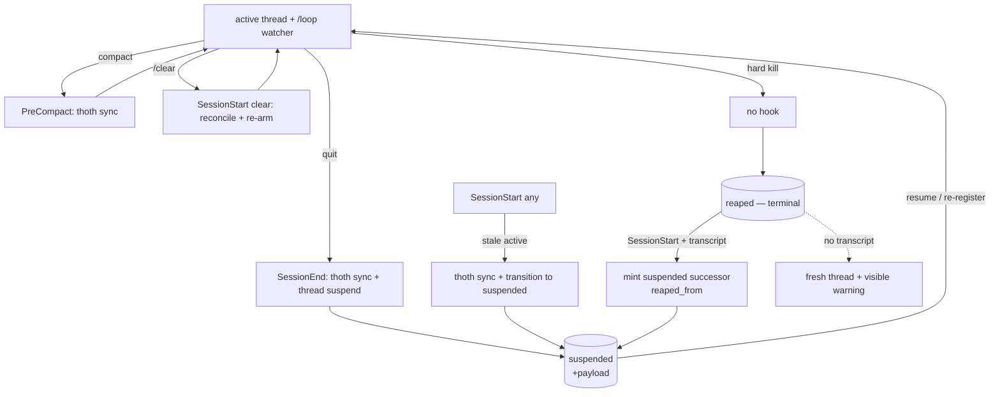

# ADR-025: Thoth-Gated Exit + Resumable Thread Suspend

## Status
**Accepted** — June 1, 2026 (R3 of the always-on supervisor; companion to
ADR-024 which covered R1/R2/R4/R5). codex review round 1 = *changes-requested*
(vs `fac8c6e`); all edits folded in rev 2; round 2 = *approve* against `9e74be4`
(`20260601-codex-pantheon-adr025-rev2-confirm`). Implementation (Go + hook)
owned by claude-pantheon, queued after its ADR-024 lane.

## Context
A27 binds a thread's life to `register → close`. ADR-024 made *birth* and
*liveness* correct. **Exit is still ungoverned.** R3 of the supervisor vision
requires: before a thread leaves, it MUST (a) capture memory to Thoth and
(b) update the router to a terminal-or-resumable status — never just vanish.

Today only **one of the three exit doors** is gated:

| Door | Native hook | Wired today? | Thread survives? |
| :--- | :--- | :--- | :--- |
| **compact** | `PreCompact` | **Yes, user-scope only** — `~/.claude/settings.json` runs `sirsi thoth sync` + `sirsi thoth compact` (verified 2026-06-01). **Not** in project `.claude/settings.json` (which has only `SessionStart` + `UserPromptSubmit`). | yes (same session) |
| **quit / exit** | `SessionEnd` (cannot block) | **No** | no |
| **`/clear`** | `SessionStart(clear)` | partial (inbox/health only) | yes (memory wiped, PID lives) |
| **hard kill** | none | n/a (OS reaper, ADR-022) | no |

> **Hook truth (codex edit 1):** the compact gate is a real installed
> `PreCompact` **hook in user-scope** `~/.claude/settings.json` — distinct from
> the project-scope `.claude/commands/compact.md` *command* (which merely
> instructs a manual `/compact`). Per ADR-024 §4 supervisor hooks belong in
> user-scope precisely so they fire in every project; project-scope having
> neither is correct, not a gap.

The gaps: a **quit** loses unsynced memory and leaves an `active` record that the
reaper later marks `reaped` (truthful but lossy — the plans/context are gone). A
**`/clear`** wipes context and kills the `/loop` watcher mid-session, leaving the
thread registered-but-unwatched until SessionStart re-arms. And there is **no
resumable state** — `close` is terminal, so a thread that means "I'm pausing,
resume me later with my memory and open items" has no way to say so.

`sirsi thread` today has `register|heartbeat|list|close|prune|discover|scout` —
**no `suspend`, no `resume`.**

## Decision

### 1. New `suspended` thread state — resumable-but-not-live, carries memory + plans
Add a **new resumable lifecycle status** `suspended` (codex edit 4 — phrased as a
lifecycle status, not "the fourth status," since the enum already carries
`idle`/`blocked`/`stale-heartbeat` alongside `active`/`closed`/`reaped`). A
suspended record carries a `suspend_payload`:

```json
{
  "status": "suspended",
  "suspend_payload": {
    "thoth_ref": "<Stele ledger id (ADR-014) — primary; memory-commit SHA as secondary cross-ref>",
    "owned_open_items": ["<router item ids still addressed to this agent>"],
    "resume_prompt": "<one-line continuation, e.g. a NOTEBOOKS resume name>",
    "suspended_at": "<UTC>"
  }
}
```

`thoth_ref` primary format is a **Stele ledger id** (ADR-014) — the durable,
content-addressed ledger entry for the captured memory; the git commit SHA of the
sync is recorded as a secondary, human-verifiable cross-ref (codex edit 6).

**`suspended` is resumable-but-not-live (codex edit 2).** It is non-prunable and
re-adoptable, but it is **not** treated as live by registration/heartbeat:

- A `heartbeat` targeting a `suspended` record is **rejected** (it does not
  silently revive it or refresh `LastSeenAt`).
- Re-`register` with the same `agent_id` that matches a `suspended` record MUST
  go through the **`resume` transition** (§2) — restoring payload, re-arming the
  watcher, printing the resume prompt — **not** the existing "same agent+PID
  updates `LastSeenAt`" fast path. Reviving without resume would drop the owned
  items and re-arm rules.

`suspend` ≠ `close`: `close` is terminal (done, prune-eligible); `suspend` means
"paused, re-adoptable." Both are valid Thoth-gated exits; the default on a
non-terminal exit is **suspend** (most exits are pauses, not deaths).

### 2. Two verbs — `sirsi thread suspend` / `sirsi thread resume`
- `sirsi thread suspend --thread <id>` — flips `active → suspended`, snapshots
  the payload (calls `thoth sync` first so `thoth_ref` is fresh, then records
  owned open items + resume prompt). Idempotent.
- `sirsi thread resume --thread <id>` (or re-`register` with the same `agent_id`
  adopting a suspended record) — restores: re-surfaces `owned_open_items`, prints
  `resume_prompt`, re-arms the watcher (ADR-024 §3), flips `suspended → active`.

### 3. The exit handshake — one rule, three doors
**Before any exit, capture Thoth AND set status.** Mapped to the only hooks the
platform gives us:

- **compact** → the user-scope `PreCompact` hook already syncs Thoth; thread
  stays `active` (compact is not an exit). No change beyond what's wired in
  user-scope. ✓
- **quit/exit** → **new `SessionEnd` hook**: `sirsi thoth sync` then
  `sirsi thread suspend` (best-effort — `SessionEnd` cannot block, so it is *a*
  gate, not *the* gate).
- **`/clear`** → `SessionStart(clear)`: reconcile (below) + re-arm watcher.
- **hard kill** → no hook fires; OS-truth reaper (ADR-022) marks `reaped`
  (terminal, **stays terminal**); next start may mint a *successor* record (§4).

### 4. SessionStart reconciliation is the authoritative gate
Because `SessionEnd` cannot block and `/clear`/kill may skip it, **SessionStart
is where the gate is actually enforced** (it always fires). It heals two distinct
dirty-exit shapes, preserving ADR-022's terminal-status invariant (codex edit 3):

- **Stale `active` record** (the `/clear` / soft-exit case) — heartbeat stale, no
  `suspended`/`closed` transition. Heal in place: `thoth sync` (retroactively
  capture from the still-present transcript), then transition the record
  `active → suspended`. It was never terminal, so this is legal.
- **`reaped` record** (the hard-kill case) — `reaped` is **terminal and is never
  revived**. Instead, if the transcript is still locally available, mint a **new
  `suspended` successor record** carrying `reaped_from: <reaped_thread_id>`, with
  a `thoth_ref` from a retro sync. If no transcript is recoverable, open a fresh
  thread and **emit a visible warning** that memory recovery was not possible —
  never silently. The reaped record stays reaped (ADR-022 intact).

This makes the guarantee **eventually-gated**: best-effort at exit, *guaranteed*
at next start. Trust the OS + the transcript, not the agent's good behavior (the
ADR-022 principle).

### 5. Default-on, same off-switch
The `SessionEnd` hook and reconciliation are user-scope (ADR-024 §4) and honor
`SIRSI_SUPERVISOR=0` (skip managed suspend/reconcile; manual `suspend`/`resume`
verbs always work — off means "don't manage me," not "remove the capability").

## Neith's Triad (A22)

### Data Flow Architecture


### Recommended Implementation Order
1. `suspended` status + `suspend_payload` in `internal/router` thread model + `threads.json` (required; everything depends on it).
2. `sirsi thread suspend` verb (required).
3. `SessionEnd` hook → `thoth sync` + `suspend` (required; closes the quit door).
4. SessionStart reconciliation of dirty exits (required; the authoritative gate).
5. `sirsi thread resume` verb + re-register adoption (required for the round-trip).
6. `prune` honors `suspended` as non-terminal — never auto-pruned (required guard).

### Key Decision Points
| Question | Options | Recommendation |
| :--- | :--- | :--- |
| Default exit status on quit? | suspend / close | **suspend** — most exits are pauses; close stays explicit. |
| Enforce gate where SessionEnd can't block? | block (impossible) / best-effort+reconcile | **best-effort at exit + guaranteed at SessionStart** — eventually-gated. |
| Where does resumable state live? | new store / `threads.json` | **`threads.json` payload** — one store, reuses existing reaper/list. |
| Capture source when agent didn't sync? | give up / transcript | **transcript** — SessionStart retro-syncs from the `.jsonl` still on disk. |

## Acceptance tests (required before merge; owner: claude-pantheon)
- `thread suspend --thread X` flips active→suspended, payload has a Stele `thoth_ref` + commit cross-ref + owned items; idempotent on repeat.
- `thread resume --thread X` restores active, re-surfaces owned items, prints resume_prompt, re-arms one watcher (ADR-024 idempotence).
- **resumable-but-not-live**: a `heartbeat` to a `suspended` record is rejected (no revive, no `LastSeenAt` refresh); a re-`register` matching a suspended record routes through the `resume` transition, **not** the same-agent+PID fast path.
- `SessionEnd` hook runs `thoth sync` then `thread suspend`; on failure it **surfaces a visible error** (health line / stderr), never swallowed.
- SessionStart with a stale `active` record + no suspend/close → reconciliation transitions it `active→suspended` after a retro `thoth sync` (in-place heal).
- SessionStart with a `reaped` record + available transcript → mints a `suspended` **successor** carrying `reaped_from`; the reaped record stays reaped. No transcript → fresh thread + visible "memory unrecoverable" warning.
- `prune` removes `closed`/`reaped` but **never** `suspended`.
- `SIRSI_SUPERVISOR=0` skips managed SessionEnd suspend + reconciliation; manual `suspend`/`resume` still work.

## Consequences
- A thread can no longer vanish lossy: quit → suspended-with-memory; kill/clear →
  healed at next start. The reaper stops being the *only* exit truth.
- `suspended` gives multi-day workstreams (the NOTEBOOKS "resume name" pattern) a
  first-class router home — resume re-adopts memory + open items in one verb.
- Completes A27's lifecycle: `register → heartbeat → (suspend ⇄ resume)* → close`.

Refs: PANTHEON_RULES.md A27 (lifecycle), A26 (relay/owned items), A22 (Triad);
ADR-024 (R1/R2/R4/R5 companion), ADR-022 (OS-truth reaping), Thoth memory system.
Resolves R3 of the always-on supervisor.
