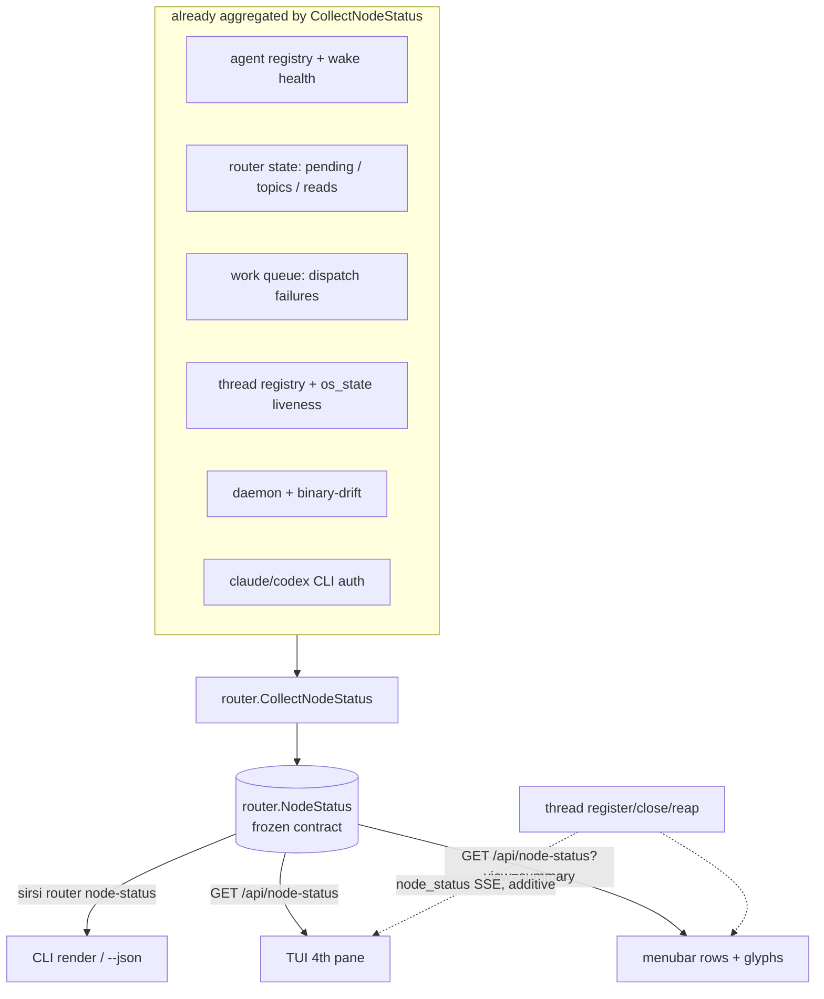

# ADR-026: Horus Ops-Dashboard — One Typed Read-Model for the Operator Surface

## Status
**Accepted** — June 2, 2026. Design APPROVED by claude-pantheon (verdict
`20260602-022950`, two caveats both folded in: `schema_version` field on the
contract; `OpsSummary` is bounded top-N + `more_agents` overflow). **Steps 1–3
shipped by claude-home** (this commit): `router.NodeStatus.SchemaVersion`
(`1.0.0`), `GET /api/node-status` (+`?view=summary`), `sirsi router
node-status [--json]`. Routed to codex for arch-verify of the implementation.
**Steps 4–5 (surface chrome — menubar rows + TUI 4th pane) are claude-pantheon's
lane** and are now unblocked.

This realizes ADR-015 ("the dashboard **is** Horus") as a real operator surface,
distinct from the `internal/horus` code-graph that currently owns the `Horus`
name in the dashboard. It is the **read** companion to the frozen **action**
contract (ADR-020 / `DASHBOARD_CONTRACT_MATRIX.md`).

## Context

The always-on supervisor (A27) now has a correct lifecycle — birth/liveness
(ADR-024), exit (ADR-025), OS-truth reaping (ADR-022), binary-drift (ADR-023).
But **the operator cannot see it.** There is no rendered command-center that
shows, across all vendors (Claude + Codex + resident surfaces), which threads are
alive, who has unread inbox, queue depth, dispatch failures, and host drift.

The read-model itself **already exists and is complete**:
`router.CollectNodeStatus()` (`internal/router/nodestatus.go`) aggregates, in one
pass, into a single `NodeStatus`:

- registered agents + per-agent wake-mechanism readiness (`WakeHealth`);
- router queue — pending-by-agent, active topics, completed count, last
  Claude/Codex read;
- work-queue dispatch failures (last 5, newest first);
- **live + stale threads** with `os_state` OS-truth PID liveness (ADR-022) —
  Horus can never show a dead PID as live;
- daemon health + **binary drift** (configured vs present vs `go run`, ADR-023);
- agent CLI auth health (`claude`/`codex` found + authenticated, blocked-item
  counts).

**The gap is exposure, not computation.** `NodeStatus` is trapped in Go:

1. **Not in the dashboard contract.** `internal/dashboard/contract.go` freezes
   `StatsResponse` (system stats) but has **no** ops/router read-view. The
   contract matrix's final row is explicit: *Router ack → MISSING (no
   `/api/router/*`)*. No surface can render the ops-view over HTTP.
2. **No CLI verb.** Rule A27 canon and claude-pantheon's lane ACK both reference
   "Horus `router node-status`" — **a verb that does not exist.** Today only
   `sirsi router status` (queue summary) and `sirsi thread list --json`
   (raw threads) are reachable; neither is the aggregated node view.
3. **No surface projection.** The menubar hosts the dashboard server in-process
   (`cmd/sirsi-menubar/main.go:131-143`) but renders none of this; the TUI
   scaffold (`internal/tui/`) has no ops pane.

Without ADR-026, each surface would be forced to fan out across 6+ leaf
endpoints (`/api/stats`, `/api/ra/status`, `/api/notifications`, …) and
**re-aggregate independently** — the exact "every surface invents its own
semantics" anti-pattern the frozen action contract was created to kill.

## Decision

### 1. `router.NodeStatus` IS the Horus ops read-model — freeze its JSON shape as contract
No new read-model is invented and no parallel one is forked (ADR-020 one-core;
claude-pantheon constraint #1). `router.NodeStatus` + its projections
(`ThreadSummary`, `AgentHealthCheck`, `AgentWakeHealth`, `WorkItemFailure`) are
**promoted to a frozen, additive contract**. `internal/dashboard` imports
`internal/router` and serves the type directly (consumer→producer direction; no
cycle — `router` must never import `dashboard`). The JSON shape is frozen the way
`StatsResponse` is: additive-only, snake_case, nil-safe.

### 2. Typed `GET /api/node-status` — NOT `/api/horus`
The read endpoint is **`GET /api/node-status`**, returning `router.NodeStatus`.

> **Challenge to the lane framing (Rule A23 / Rule 1):** the resume framing said
> "typed `GET /api/horus`," but `/api/horus/*` is **already the code-graph
> namespace** (`/api/horus/scan|query|report` → `horus.SymbolGraph` /
> `horus.WorkstationReport`, `internal/horus`). Reusing it for the ops-view would
> conflate two distinct Horus meanings (structural code symbols vs. the
> operator command-center). The endpoint name mirrors the Go type (`NodeStatus`)
> and the CLI verb (`router node-status`), keeping one name → one meaning.

- `GET /api/node-status` → full `NodeStatus` (TUI / browser / macapp consume).
- `GET /api/node-status?view=summary` → a small derived `OpsSummary` (live thread
  count, per-agent `{heartbeat, inbox_depth}` glyph rows, total queue depth,
  worst drift/health badge) for the **menubar**, which is a menu of compact rows,
  not a canvas (claude-pantheon constraint #2). The summary is a pure reduction
  of `NodeStatus` — never a second source.

### 3. `sirsi router node-status [--json]` — make the A27-referenced verb real
A cobra verb wires `CollectNodeStatus()` to the CLI: styled lipgloss render
(Rule A10) by default, frozen `--json` (= the HTTP body) for piping and for
CLI-only surfaces with no HTTP. This closes the canon/implementation gap where
A27 names a verb that was never built. (Verb home is `sirsi router node-status`,
mirroring `router status`; an alias under `sirsi thread` is optional.)

### 4. Surfaces are read-only projections of the one read-model — boundary held
Every surface **projects** `NodeStatus`; none re-aggregates. Per the ratified
boundary, claude-home defines the contract type + endpoint + CLI shape (this
ADR); claude-pantheon owns the rendering shells:

- **menubar** — `?view=summary` rows + glyphs + "Open full dashboard/TUI"; no
  tables/panes inside the menu. Read-only render = a **resident heartbeat-only**
  thread (ADR-024 §1 / `watcherspec.go` `native-runloop`), not an inbox worker.
- **TUI** — a 4th pane/screen rendering full `NodeStatus`, fitting the existing
  keyboard model + command palette (`internal/tui/state.go` command ids).
- **macapp** — deferred (no macOS app yet); inherits the same contract when it
  lands. A19: never write inside `/Applications/*.app`.

### 5. Refresh: poll now, SSE-on-change additive later
Surfaces poll `GET /api/node-status` on a bounded interval ≥ the heartbeat cadence
(~60s for resident surfaces; the menubar's existing stats loop piggybacks — no
new timer). **Additive, deferred:** emit a `node_status` event on the existing
`EventBuffer` (`/api/events` SSE) when a thread registers/closes/reaps so surfaces
refresh on change instead of poll-only. The SSE path is opt-in and never required
for correctness.

### 6. Honesty + safety inherited, not re-implemented
The ops-view shows only what the read-model already proves: `os_state` (ADR-022)
means a gone/zombie PID can never render live; `binary_drift` (ADR-023) surfaces
stale-deploy; a missing/blocked agent CLI renders its real auth error. The
endpoint is **read-only** — zero destructive actions, no `ConfirmGuard` surface,
nothing to gate. Actions stay in the frozen action contract.

## Neith's Triad (A22)

### Data Flow Architecture

### Recommended Implementation Order
1. Freeze `NodeStatus` JSON shape as contract + add the read row to
   `DASHBOARD_CONTRACT_MATRIX.md` (required; the matrix is the gate per codex).
2. `GET /api/node-status` (+ `?view=summary` → `OpsSummary`) in
   `internal/dashboard`, importing `router.NodeStatus` (required).
3. `sirsi router node-status [--json]` CLI verb over `CollectNodeStatus`
   (required; makes the A27-referenced verb real).
4. **menubar** summary projection — claude-pantheon (required for first surface).
5. **TUI** 4th-pane projection — claude-pantheon (required for full view).
6. `node_status` SSE-on-change event (optional fast-follow; poll suffices).

### Key Decision Points
| Question | Options | Recommendation |
| :--- | :--- | :--- |
| Read endpoint name? | `/api/horus` / `/api/node-status` | **`/api/node-status`** — `/api/horus/*` is the code-graph; mirror the type + verb, one name → one meaning. |
| New read-model or reuse? | mirror like `StatsResponse` / serve `router.NodeStatus` | **serve `router.NodeStatus`** — it is already the first-class aggregate; mirroring would fork the model. |
| menubar full view or summary? | full `NodeStatus` / derived `OpsSummary` | **`OpsSummary`** — menubar is a menu of rows, not a canvas (constraint #2). |
| Refresh mechanism? | poll / SSE-only / poll+SSE | **poll now, SSE additive** — correctness never depends on the stream. |
| Who renders the surfaces? | claude-home / claude-pantheon | **claude-pantheon** — surface chrome is its lane; this ADR defines only the read contract. |

## Acceptance tests (required before merge; surface owner: claude-pantheon)
- `GET /api/node-status` returns a `router.NodeStatus` whose `--json` shape is
  contract-identical to `sirsi router node-status --json` (same schema; CLI is
  pretty-printed, HTTP body is compact — one read-model, two
  transports).
- A thread whose PID is gone/defunct renders `os_state` ≠ alive and is **never**
  counted in `live_thread_count` (ADR-022 honesty, inherited).
- A staged stale sibling binary surfaces `binary_drift` in the node-status view
  (ADR-023, inherited).
- `?view=summary` returns an `OpsSummary` that is a pure reduction of the same
  `NodeStatus` (counts/glyphs reconcile exactly; no field sourced elsewhere).
- The endpoint is read-only: no method mutates state; no `ConfirmGuard` path.
- menubar summary render registers as a resident heartbeat-only thread
  (`native-runloop`, ≥60s), not an inbox worker (ADR-024 §1).
- `SIRSI_SUPERVISOR=0` does not break the read view (it reflects whatever state
  exists; it never manages threads itself).

## Consequences
- ADR-015 ("the dashboard is Horus") becomes a real operator surface; the
  multi-agent fleet (A26/A27) is finally **visible** in one place.
- One read-model, N read-only projections — surfaces cannot drift apart because
  none re-aggregates (the action-contract principle, applied to reads).
- The `router node-status` verb named by A27 canon stops being vapor.
- `/api/horus` stays unambiguously the code-graph; the ops-view is
  `/api/node-status`.

Refs: PANTHEON_RULES.md A27/A26/A22/A10/A19/A23; ADR-015 (Horus = dashboard),
ADR-020 (one-core surface contract), ADR-022 (OS-truth liveness),
ADR-023 (binary drift), ADR-024 (resident surfaces / `watcherspec.go`),
ADR-025 (supervisor exit); `DASHBOARD_CONTRACT_MATRIX.md` (action companion);
`HORUS_OPS_READMODEL_R4_INVENTORY.md` (the read-model source inventory).
Lane boundary: router items `20260601-235419` / `20260601-235652`.
