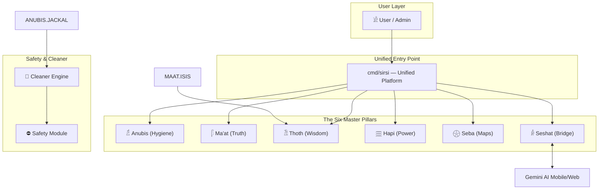
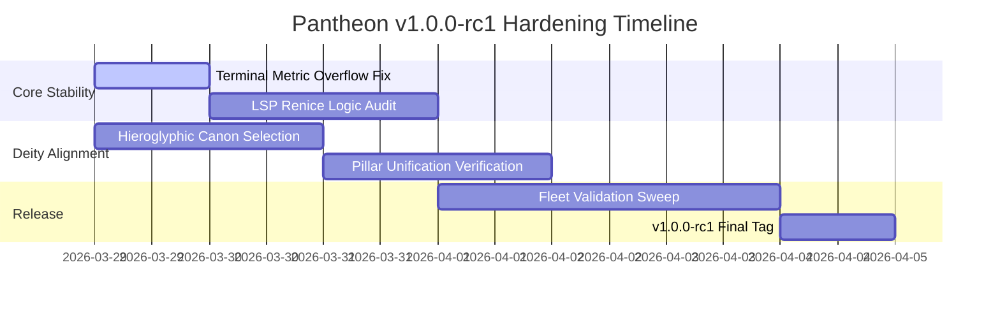

# Architecture Design — Sirsi Pantheon
**Version:** 2.2.0
**Date:** May 19, 2026
**Custodian:** 𓁯 Net (The Weaver)

---

## 1. System Overview

Sirsi Pantheon is a unified infrastructure intelligence and DevSecOps platform built on a **Deity-First Architecture**. It operates on the "One Install. All Deities." standard, where a single hardened binary manages the entire workstation and fleet lifecycle.

### 1.1 The Six Master Pillars
The Pantheon is organized into six divine pillars, each assigned a canonical Ancient Egyptian Hieroglyph. This consolidation removes architectural fragmentation and ensures absolute aesthetic purity across all interfaces.

- **𓁢 ANUBIS (Hygiene)**: Infrastructure hygiene, ghost app hunting (Ka), file deduplication (Mirror), and resource protection (Guard).
- **𓆄 MA'AT (Governance)**: Codebase auditing (Scales), QA standards, and autonomous remediation (Isis).
- **𓁟 THOTH (Knowledge)**: Persistent project memory, rule-grounded intelligence, and the zero-token brain ledger. RTK output filtering, Vault context sandboxing, Horus structural code graphs.
- **𓈗 HAPI (Compute)**: Hardware optimization, GPU/VRAM flow, and ANE/NPU acceleration (Sekhmet).
- **𓇽 SEBA (Mapping)**: Infrastructure topology, project registry (Book), and fleet discovery (Scarab).
- **𓁆 SESHAT (Scribe)**: Knowledge bridge (Gemini/NotebookLM), MCP context server, and AI sync.

> **Knowledge Substrate (𓅓) — adjacent capability, not a pillar.** Codified in [ADR-019](ADR-019-KNOWLEDGE-SUBSTRATE.md) on 2026-05-26. The substrate is a *semantic verification* layer derived from source via the Understand-Anything plugin; it complements Thoth (memory) and Seba (architectural map) without competing with either deity's sovereignty. Today's per-repo `.understand-anything/knowledge-graph.json` is the local feeder for the future **Sirsi hypergraph** on Hedera Consensus Service (workspace-canon vision at `~/Development/HYPERGRAPH_VISION.md`). See [§ Knowledge Substrate](#knowledge-substrate) for the full integration spec.

```
                    ┌─────────────────────────────┐
                    │         USER / ADMIN         │
                    │     (runs `sirsi` CLI)    │
                    └──────────────┬──────────────┘
                                   │
                    ┌──────────────▼──────────────┐
                    │       PANTHEON PLATFORM     │
                    │                             │
                    │  ┌────────┐  ┌───────────┐  │
                    │  │ Anubis │  │   Ma'at   │  │
                    │  │(Clean) │  │  (Truth)  │  │
                    │  └────────┘  └───────────┘  │
                    │  ┌────────┐  ┌───────────┐  │
                    │  │ Thoth  │  │   Hapi    │  │
                    │  │(Memory)│  │ (Power)   │  │
                    │  └────────┘  └───────────┘  │
                    │  ┌────────┐  ┌───────────┐  │
                    │  │  Seba  │  │  Seshat   │  │
                    │  │ (Map)  │  │ (Bridge)  │  │
                    │  └────────┘  └───────────┘  │
                    │                             │
                    │  ┌─────────────────────────┐ │
                    │  │  Token Intelligence     │ │
                    │  │  RTK→Vault→Horus        │ │
                    │  └─────────────────────────┘ │
                    │                             │
                    │       Transport Layer       │
                    │  (SSH / gRPC / kubectl)     │
                    └──────┬──────┬───────┬───────┘
                           │      │       │
                    ┌──────▼─┐ ┌──▼────┐ ┌▼────────┐
                    │ agent  │ │ agent │ │  agent   │
                    │ (VM)   │ │ (Pod) │ │  (NAS)   │
                    └────────┘ └───────┘ └──────────┘
```

---

## 2. Pillar Architecture

### 2.1 Anubis — The Hygiene Pillar (𓁢)
- **Engine:** Jackal (File Scanning), Ka (Ghost Detection).
- **Scope:** Workstation hygiene, cache purging, orphan application hunting.
- **Functions:** `weigh`, `judge`, `ka`, `mirror`, `guard`.

### 2.2 Ma'at — The Governance Pillar (𓆄)
- **Engine:** Scales (Policy Auditing), Isis (Remediation).
- **Scope:** Code quality, ADR compliance, autonomous healing of lint/test wounds.
- **Functions:** `audit`, `scales`, `heal`.

### 2.3 Thoth — The Intelligence Pillar (𓁟)
- **Engine:** Brain (Neural Weights), Ledger (Persistent Context).
- **Scope:** Zero-token context savings, rule-grounded AI intelligence.
- **Functions:** `sync`, `install-brain`.

### 2.4 Hapi — The Compute Pillar (𓈗)
- **Engine:** Sekhmet (ANE Acceleration), Yield (Resource Management).
- **Scope:** GPU/VRAM optimization, hardware profiling, NPU-driven workflows.
- **Functions:** `scan`, `profile`, `compute`.

### 2.5 Seba — The Mapping Pillar (𓇽)
- **Engine:** Scarab (Discovery), Book (Project Registry).
- **Scope:** Visual dependency graphs, fleet discovery, VLAN/subnet mapping.
- **Functions:** `scan`, `book`, `fleet`.

### 2.6 Seshat — The Scribe Pillar (𓁆)
- **Engine:** Gemini Bridge, MCP Server.
- **Scope:** Bidirectional sync between Gemini, NotebookLM, and Antigravity IDE.
- **Functions:** `sync`, `list`, `server`.

### 2.7 Token Intelligence Layer

The Token Intelligence Layer composes three modules that minimize token consumption before content reaches AI context windows. They operate as a pipeline: **RTK -> Vault -> Horus**.

- **RTK (The Sieve)** — Output filter applied at the source. Strips ANSI escape sequences, deduplicates consecutive identical lines, and truncates with tail preservation. Reduces raw tool output by 60-90% before it enters the context window. CLI: `sirsi rtk`. MCP tool: `filter_output`.

- **Vault (The Keeper)** — Context sandbox for output that is still too large after RTK filtering. Stores content in a SQLite FTS5 database and builds a BM25 code search index. Content is queryable later without occupying context window space. CLI: `sirsi vault`. MCP tools: `vault_store`, `vault_search`, `vault_get`, `vault_stats`, `code_index`, `code_search`.

- **Horus (The All-Seeing)** — Structural code graph engine. Uses Go AST symbol extraction to produce file outlines (declarations only, no function bodies) that are 8-49x smaller than full source. Serves symbol context queries for targeted code understanding without reading entire files. CLI: `sirsi horus`. MCP tools: `code_symbols`, `code_outline`, `code_context`.

**Composition**: All three modules compose naturally. RTK filters raw output, Vault sandboxes what remains too large, and Horus replaces full-file reads with structural outlines. Together they add **10 new MCP tools** and **8 new Stele events** to the platform.

### 2.8 CTR Hypervisor Layer (ADR-017)

The CTR (Cross-Team Router) Hypervisor is Ra-owned infrastructure that orchestrates AI agents across the Sirsi portfolio. It is homed in Pantheon at `.agents/idea-router/`.

**Ra** owns Sirsi-wide orchestration: agent registry (`agents.json`), work queue (`state.json`), dispatch protocol, relay verification, super-agent mandates, and portfolio authority.

**Horus** owns the per-desktop runtime view: daemon health, local agent/window visibility, local repo status, and the operator surface (TUI, menubar).

**Supporting deities**: Thoth preserves router memory across sessions. Ma'at validates router governance. Net keeps portfolio goals aligned.

**Components**:
- `internal/router/` — Router CLI commands, service layer, runner, work items
- `.agents/idea-router/` — Filesystem protocol: proposals, reviews, decisions, state
- `cmd/sirsi/routercmd.go` — Cobra command registration for `sirsi router *`
- `configs/` — Agent launch configurations

**User surface**: `sirsi router status | work | daemon | install-agent | smoke`

---

## 3. Deployment & Distribution

### 3.1 One Install. All Deities.
The `sirsi` binary is the single source of truth. It is statically compiled for macOS (ARM64/Intel) and Linux.

### 3.2 Registry (docs/index.html)
The public registry provides a high-fidelity visual map of the 6 Master Pillars. All icons and metrics are dynamically reported from the CLI's internal stats engine.

---

## 4. Data Flow Architecture ⚠️ MANDATORY (Neith's Triad §1)



## 5. Recommended Implementation Order ⚠️ MANDATORY (Neith's Triad §2)



## 6. Key Decision Points ⚠️ MANDATORY (Neith's Triad §3)

| Decision | Options | Recommendation | Rationale |
| :--- | :--- | :--- | :--- |
| **Pillar Count** | 12 Standalone vs 6 Integrated | **6 Integrated** | Reduces cognitive load and simplifies the CLI hierarchy while maintaining all functionality. |
| **LSP Thresholds** | Static (1GB) vs Dynamic (% of total) | **Static (1GB)** | Third-party LSPs should remain lean. Host LSP is excluded from this threshold as it handles core AI reasoning. |
| **Branding Anchor** | Pyramid vs Deity Icon | **Pyramid (𓇳)** | The Pyramid represents the unified platform root, while Deities represent specialized modules. |

---

## 7. TUI Architecture (v0.19.0)

The TUI (`internal/output/tui.go`) is the primary interactive interface, launched via `sirsi` with no arguments.

### 7.1 Core Components
- **BubbleTea Model** — `TUIModel` struct with viewport, input bar, deity roster, view stack
- **Streaming Output** — Commands stream line-by-line via `chan string` + `bufio.Scanner` (replaces batch buffering)
- **Suggest Engine** — `internal/suggest/` provides context-aware action recommendations consumed by TUI, CLI, and menubar
- **View Stack** — Push/pop navigation: `esc` pops to previous view, enabling safe drill-down (findings → category → back)
- **Persistent State** — Deity run outcomes saved to `~/.config/pantheon/tui-state.json`

### 7.2 Data Flow

```
User Input → dispatch() → inferSubcommand() → exec.Command (piped)
                                                    ↓
                                              streamCh (chan string)
                                                    ↓
                                         handleStreamLine() → viewport
                                                    ↓
                                         suggest.After(ctx) → "What's Next" panel
                                                    ↓
                                         savePersistedState() → tui-state.json
```

### 7.3 Shared Suggestion Engine (`internal/suggest/`)

| Function | Purpose |
| :--- | :--- |
| `After(ctx Context) []Action` | Success suggestions for all 10 deities |
| `OnError(ctx Context) []Action` | Error remediation with pattern matching |
| `Placeholder(ctx Context) string` | Contextual input bar hints |
| `Commands(ctx Context) []string` | Tab-cycle command list |

**Consumers:** TUI (BubbleTea), CLI (terminal footer), Menubar (toast + SSE events)

---

## 8. Package Registry

| Package | Path | Role |
| :--- | :--- | :--- |
| jackal | `internal/jackal/` | Scan rules and findings |
| maat | `internal/maat/` | Governance and quality gates |
| brain | `internal/brain/` | Thoth memory and MCP server |
| guard | `internal/guard/` | Isis health and remediation |
| seba | `internal/seba/` | Hardware and topology |
| horus | `internal/horus/` | Code graph and symbols |
| rtk | `internal/rtk/` | Output filtering |
| vault | `internal/vault/` | Context sandbox (SQLite FTS5) |
| osiris | `internal/osiris/` | Snapshot risk detection |
| seshat | `internal/seshat/` | Knowledge bridge |
| ra | `internal/ra/` | Agent orchestration |
| neith | `internal/neith/` | Scope weaving |
| **suggest** | **`internal/suggest/`** | **Context-aware action recommendations (TUI, CLI, menubar)** |
| output | `internal/output/` | TUI model, rendering, view stack |

---

## Knowledge Substrate

> Codified by [ADR-019](ADR-019-KNOWLEDGE-SUBSTRATE.md) on 2026-05-26. This section is the architecture-level integration spec; the ADR is the decision record; `docs/user-guides/knowledge-substrate.md` is the user-facing reference; `docs/pantheon/knowledge-substrate.html` is the public web surface.

### Sovereignty matrix

The Knowledge Substrate is a *semantic verification* layer that complements two existing deity sovereignties without competing with either:

| Tool | Deity glyph | Owns | Artifact |
|---|---|---|---|
| **Thoth** | 𓁟 | Memory and intent — *why* / *what next* | `.thoth/memory.yaml` + `.thoth/journal.md` |
| **Seba** | 𓇽 | Architectural mapping — canonical *topology* (Rule A25 sovereignty) | `internal/seba/` (deity-owned code) |
| **Knowledge Substrate** | 𓅓 | Semantic verification — auto-derived *what exists* | `.understand-anything/knowledge-graph.json` |

### Per-repo artifacts (today's local layer)

Each Sirsi repo with the substrate enabled maintains:

```
.understand-anything/
├── knowledge-graph.json    # 2.9 MB JSON on sirsi-pantheon (3,340 nodes, 6,947 edges)
├── meta.json               # Commit hash + analysis timestamp
├── fingerprints.json       # 907 per-file structural hashes for incremental refresh
└── .understandignore       # Exclusion patterns (gitignore-style)
```

### Bidirectional Thoth ↔ Substrate sync

Codified in global `~/CLAUDE.md`. After every `/understand` run in any Thoth-enabled repo:

1. Update the `## Knowledge Graph (Understand-Anything)` block in `.thoth/memory.yaml` with the new commit hash, node/edge counts, layer counts.
2. Append a delta paragraph to `.thoth/journal.md` describing what changed (new packages, layer shifts, edge-count moves).
3. If no Knowledge Graph block exists yet, create one matching the schema in this repo's `.thoth/memory.yaml`.

The contract is enforced by AI session behavior, not by a hook — agents detect the gap and refresh.

### CLI surface (spec'd; implementation pending)

```
sirsi hypergraph status [--json]
sirsi hypergraph refresh [--full]
sirsi hypergraph chat <question>
sirsi hypergraph explain <path>
sirsi hypergraph diff <ref>
sirsi hypergraph layers
sirsi hypergraph tour
sirsi hypergraph export <json|dot|mermaid>
```

Gated by `configs/hypergraph.yaml` `enabled:` (config-time) and a `hypergraph` build tag (compile-time). When disabled or absent, the subcommand has zero runtime cost.

### Long-term direction — the Sirsi hypergraph

The per-repo substrate is the **feeder**, not the destination. The destination is a cross-repo, cross-agent knowledge layer built on **Hedera Consensus Service** (HCS) as the event substrate — aBFT finality (~3–5s settlement), low cost per message, optimized for high-volume / low-stakes-per-event workloads. Graph topology materializes off-chain from the HCS event stream (event sourcing); replay always converges.

Three node-types projected into the hypergraph:

- **Memory nodes** ← per-repo Thoth memory/journal events
- **Structure nodes** ← per-repo Understand-Anything graph deltas
- **Routing events** ← per-repo idea-router handoffs

Full builder vision and design principles at `~/Development/HYPERGRAPH_VISION.md` (workspace-canon, referenced from `~/Development/AGENTS.md` § Knowledge Substrate). Builders implementing the hypergraph MUST read that document before designing schemas or restructuring the local layer.

---

*𓁯 This document follows Neith's Architecture Triad (Rule A22). Updated to v2.4.0 for the Knowledge Substrate integration (ADR-019).*
